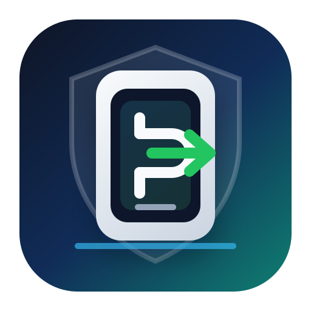
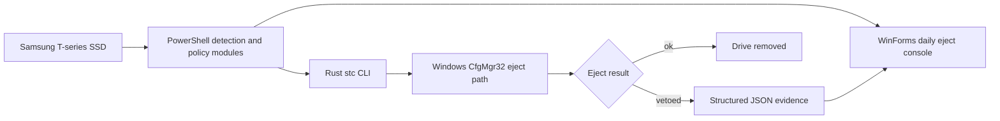

<p align="center">
  
</p>

# Samsung T-Series Console

**Windows-native safe eject, readiness checks, and blocker forensics for Samsung T7, T7 Shield, and T9 portable SSDs.**


Samsung T-Series Console is an unofficial, local-first operator utility for Samsung T-series portable SSD workflows. It turns the vague Windows "device is currently in use" moment into a governed process: identify the SSD, measure eject risk, apply documented Windows-side repair policies, attempt a real CfgMgr32 eject, and return structured evidence when Windows vetoes the request.

> This project is not affiliated with, endorsed by, or sponsored by Samsung Electronics. Product names are used only to identify compatible devices.

## Why This Exists

Portable SSDs are easy to plug in and hard to trust at unplug time. Windows may refuse removal without naming the blocker, while background services such as Windows Search, Explorer shell extensions, or vendor utilities may touch the device at the worst possible moment.

This project gives the daily unplug workflow a concrete control surface:

- which Samsung T-series SSD is connected,
- whether the filesystem and allocation unit match a sensible profile,
- whether Windows Search, Samsung Magician, Explorer, or recent system events raise eject risk,
- whether a real eject succeeds,
- and, when Windows vetoes eject, the veto type, process name, PID, command line, and affected device when available.

## Features

| Surface | What it does |
| --- | --- |
| Daily Eject Dashboard | WinForms console for the normal "can I unplug this now?" workflow. |
| Native Rust Eject | `stc eject <drive> --yes` calls Windows CfgMgr32 and returns JSON. |
| Veto Forensics | Kernel-PnP 225 events are parsed to expose blockers such as `explorer.exe` or `dllhost.exe`. |
| Windows Search Policy | Excludes currently connected Samsung T-series drive roots from indexing. |
| Samsung Magician Policy | Sets `SamsungMagicianSVC` to manual startup and stops the current service instance when elevated. |
| Readiness Evidence | Combines Disk 153 retry counters, Kernel-PnP veto counters, format policy, and blocker hints. |
| Format Guardrails | Destructive formatting is behind explicit confirmation phrases. |
| Local Only | No telemetry, no network calls, no background daemon. |

## Repair & Policy Strategy

The project treats "repair" as controlled remediation of Windows-side conditions that commonly make removable SSDs unsafe or inconvenient to eject. It does not claim to repair flash wear, controller faults, firmware defects, filesystem corruption, or physically damaged media.

Supported repair strategy:

| Strategy | Purpose | Safety posture |
| --- | --- | --- |
| Windows Search exclusion | Prevent the SearchIndexer service from scanning connected Samsung T-series drive roots. | Non-destructive registry policy update. |
| Samsung Magician service policy | Set `SamsungMagicianSVC` to manual startup and stop the running instance when elevated. | Service-scoped change; no arbitrary process killing. |
| Eject veto forensics | Convert Windows vetoes into process, PID, veto type, command line, and device evidence when available. | Observational; no forced removal. |
| Event-based readiness | Surface Disk 153 retry signals and Kernel-PnP 225 blocker events before unplugging. | Read-only event log analysis. |
| Format profile review | Recommend exFAT allocation-unit profiles for compatible Samsung T-series workflows. | Destructive formatting requires an explicit confirmation phrase. |

The default position is conservative: if the drive recently showed I/O retries, if Windows reports outstanding opens, or if the eject path returns a veto, the tool reports a blocked or caution state instead of encouraging a risky unplug.

## Architecture



## Quick Start

Requirements:

- Windows 10/11
- PowerShell 7+
- Rust toolchain for building the CLI
- Optional: administrator PowerShell for service policy changes

Download a release build from the GitHub Releases page, extract the zip, then run:

```powershell
pwsh -ExecutionPolicy Bypass -File .\src\SamsungTConsole.ps1
```

The release zip includes `target\release\stc.exe`, so the GUI can use the native Rust eject path without rebuilding.

Build the release CLI:

```powershell
cargo build --release --workspace
```

Run the GUI:

```powershell
pwsh -ExecutionPolicy Bypass -File .\src\SamsungTConsole.ps1
```

Run the CLI:

```powershell
.\target\release\stc.exe list
.\target\release\stc.exe readiness
.\target\release\stc.exe doctor --verbose
.\target\release\stc.exe eject E: --yes
```

The GUI looks for `target\release\stc.exe` first, then falls back to `target\debug\stc.exe`.

## Daily Workflow

1. Plug in a Samsung T7, T7 Shield, or T9.
2. Build the Rust CLI once with `cargo build --release --workspace`.
3. Start `src\SamsungTConsole.ps1`.
4. Apply policies if Windows Search or Samsung Magician is likely to interfere.
5. Use **Safe Eject Selected Drive** from the daily dashboard.
6. If Windows vetoes removal, inspect the JSON evidence and close the named blocker.

## CLI Contract

All CLI output is JSON by default:

```json
{
  "command": "eject",
  "payload": {
    "result": "vetoed",
    "drive": "E:",
    "veto_type": "PNP_VetoOutstandingOpen",
    "veto_process_name": "explorer.exe",
    "veto_process_id": 1234,
    "still_present": true,
    "remediation_keys": ["step-close-risk-apps", "step-retry-safe-eject"],
    "elapsed_ms": 412
  }
}
```

Exit codes:

| Code | Meaning |
| ---: | --- |
| 0 | Success |
| 10 | Eject vetoed by Windows |
| 11 | Drive not found or not a Samsung T-series removable drive |
| 12 | Device resolved but is not ejectable |
| 13 | Access denied |
| 20 | Internal error |
| 30 | Interactive confirmation declined |

## System Policy Helpers

After plugging in a Samsung T7/T7 Shield/T9, you can apply policy fixes:

```powershell
. .\src\lib\Logging.ps1
. .\src\lib\DriveDetection.ps1
. .\src\lib\SearchPolicy.ps1
. .\src\lib\MagicianPolicy.ps1

Set-STCWindowsSearchSamsungExclusion
Set-STCSamsungMagicianManualStartup
```

The Windows Search policy is drive-letter aware: if Windows assigns a different letter later, rerun the policy command to add the new root.

Stopping `SamsungMagicianSVC` requires elevation. If not elevated, the tool reports the failure instead of pretending the service was stopped.

## Example Output

Successful eject:

```json
{
  "command": "eject",
  "payload": {
    "result": "ok",
    "drive": "E:",
    "still_present": false,
    "elapsed_ms": 1272
  }
}
```

Blocked eject:

```json
{
  "command": "eject",
  "payload": {
    "result": "vetoed",
    "drive": "E:",
    "veto_type": "PNP_VetoOutstandingOpen",
    "veto_process_name": "explorer.exe",
    "veto_process_id": 1234,
    "still_present": true,
    "remediation_keys": ["step-close-risk-apps", "step-retry-safe-eject"],
    "elapsed_ms": 412
  }
}
```

## Safety Model

- Detection, readiness, risk audit, and content profiling are read-only.
- Benchmarking writes a temporary `.stc-benchmark-*.bin` file and deletes it.
- Eject requires explicit user action.
- Formatting requires a confirmation phrase that names the target drive and allocation unit.
- The tool never kills arbitrary processes automatically.

## Project Layout

```text
crates/stc-core/      Rust models, readiness, Windows adapter
crates/stc-cli/       JSON CLI wrapper around stc-core
src/                  PowerShell WinForms app and operational modules
tests/                PowerShell smoke/policy tests
locales/              Fluent strings
docs/                 Architecture, product, and strategy notes
```

## Verification

```powershell
cargo fmt --check
cargo test --workspace
pwsh -NoProfile -ExecutionPolicy Bypass -File .\tests\Smoke.Tests.ps1
pwsh -NoProfile -ExecutionPolicy Bypass -File .\tests\DailyEject.Tests.ps1
pwsh -NoProfile -ExecutionPolicy Bypass -File .\tests\Policy.Tests.ps1
```

## Privacy Note

This public repository intentionally contains no personal drive logs, backup listings, serial-number baselines, or historical diagnosis artifacts. Runtime logs are written under `logs/` and ignored by Git.

If you are open-sourcing your own fork, publish a clean repository instead of making a private working repository public. Old commits can contain logs, serial numbers, local paths, and test artifacts even after the current tree looks clean.

## Trademark Notice

Samsung, T7, T7 Shield, and T9 are trademarks or product names of their respective owners. This repository uses those names only to describe device compatibility. The project logo and banner in `assets/` are original SVG artwork for this open-source project and are not Samsung logos or official Samsung product images.

## License

MIT
